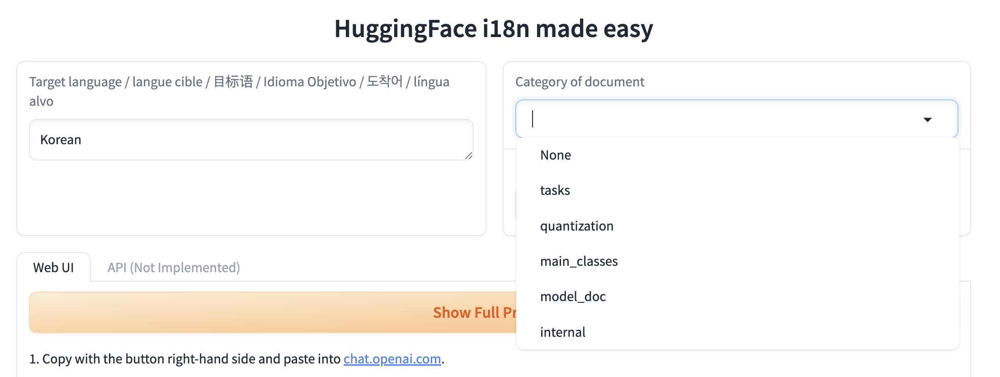
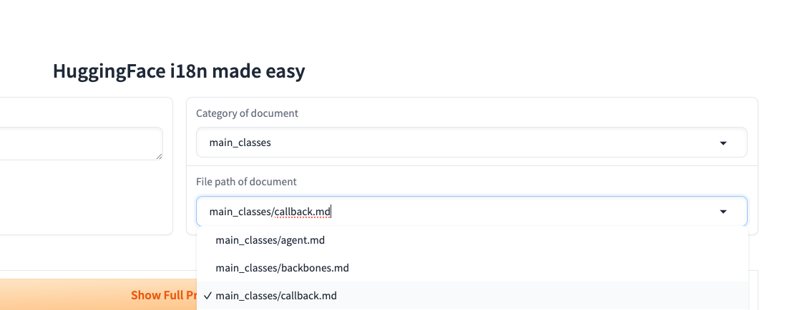
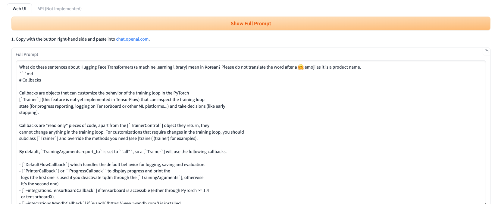
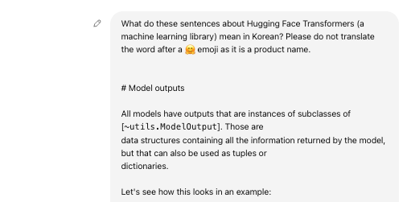
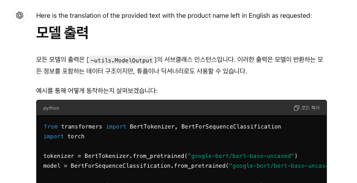
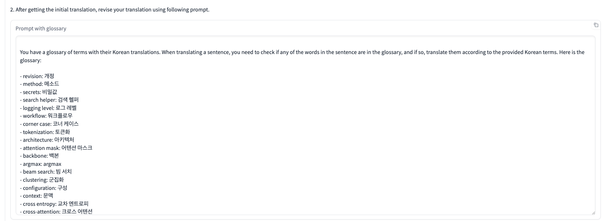
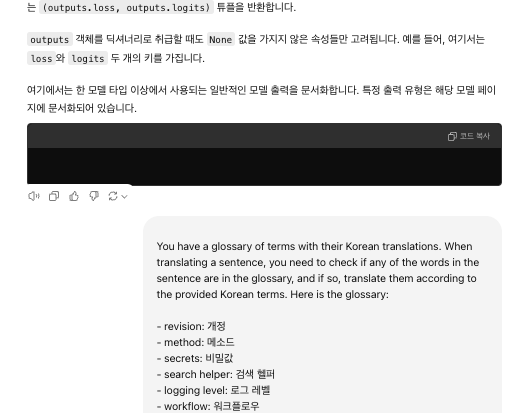
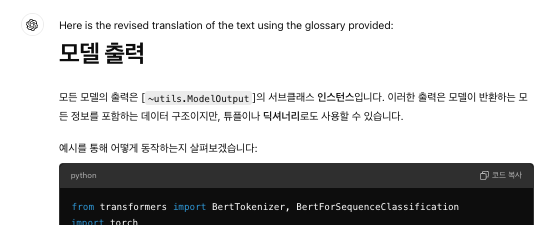
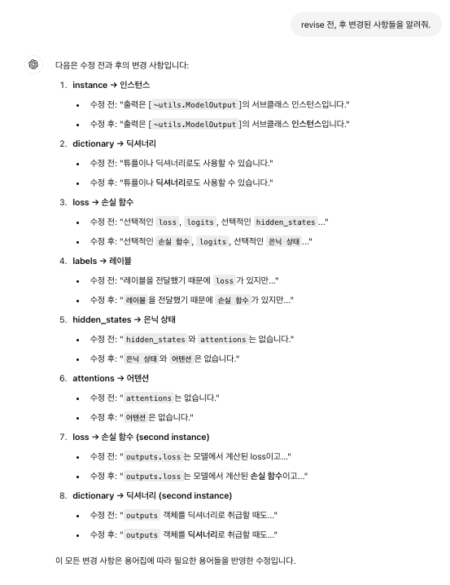
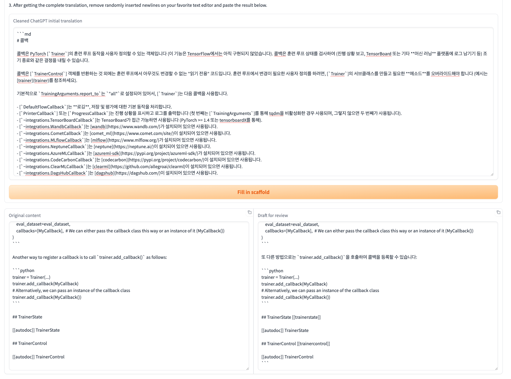

Hugging Face Transformers 문서를 한글로 번역하는 초벌 번역기 사용 방법을 안내하는 가이드입니다. 😊

## 목차

안녕하세요! Hugging Face Transformers 문서를 한국어로 번역할 때 초벌 번역기를 어떻게 사용하는지 소개해드릴게요. 😊 이 가이드를 따라하면 어렵지 않게 번역을 시작할 수 있습니다! 🎉

1. [번역할 문서의 카테고리 선택하기](#select-category)
2. [Show full prompt 누르기](#show-full-prompt)
3. [Glossary를 기반으로 번역 수정하기](#glossary-revision)
4. [수정된 단어 확인하기](#check-changes)
5. [Fill in scaffold 완료하기](#fill-in-scaffold)

---

## <a href="#select-category">1️⃣ 번역할 문서의 카테고리 선택하기</a>

먼저, 번역하고 싶은 문서의 **카테고리**를 선택해 주세요!  
예를 들어, `docs/source/en/main_classes/callback.md` 파일을 번역하려면, **대분류**인 `main_classes`를 선택해 주세요.

그 다음, **소분류**에서 번역할 파일을 선택합니다! 여기서는 `callback.md`를 선택할 수 있겠죠? 🧐  

## <a href="#show-full-prompt">2️⃣ Show full prompt 누르기</a>

이제 **show full prompt** 버튼을 눌러주세요. 그럼 번역에 필요한 프롬프트가 나타날 거예요! 📋  
이 프롬프트를 **복사**해주세요.  

**LLM**을 사용하여 기계 번역을 시작합니다. 💪  

이제 초벌 번역이 완료되었네요! 🎉  
초벌 한글 번역 결과가 나왔어요! 📝  

## <a href="#glossary-revision">3️⃣ Glossary를 기반으로 번역 수정하기</a>

이제 번역된 내용을 **glossary**를 참고해 수정해볼게요. 🤔  
스페이스에 있는 **두 번째 프롬프트**를 복사한 후, 초벌 번역이 완료된 LLM 세션 창에서 두 번째 프롬프트를 입력하세요.  

**수정된 한글 번역 결과**를 받을 수 있어요! 😎  

## <a href="#check-changes">4️⃣ 수정된 단어 확인하기</a>

혹시 어떤 단어가 **glossary**를 기준으로 수정되었는지 알고 싶으신가요? 🧐  
그렇다면, 프롬프트에 이렇게 물어보세요: **“revise 전, 후 변경된 사항들을 알려줘.”**  
그럼 LLM 세션 창에서 바로 답을 받을 수 있답니다! 💬  

## <a href="#fill-in-scaffold">5️⃣ Fill in scaffold 완료하기</a>

이제 **Fill in scaffold** 단계를 진행해볼까요? 😊 번역된 결과를 스페이스에 붙여넣고, **Fill in scaffold** 버튼을 눌러주세요. 그러면 scaffold가 포함된 최종 번역본을 얻을 수 있어요! 🚀  

---

이제 모든 번역 작업이 완료되었습니다! 🎉 수고 많으셨어요! 😄 Hugging Face의 멋진 번역 커뮤니티에 기여해 주셔서 감사드려요. 👐
