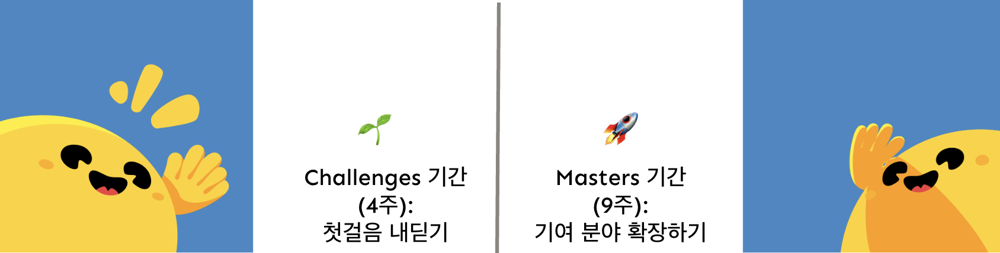
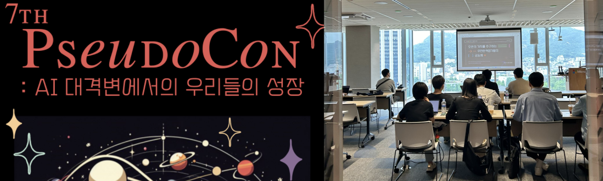
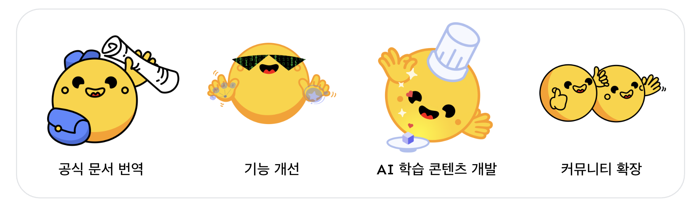
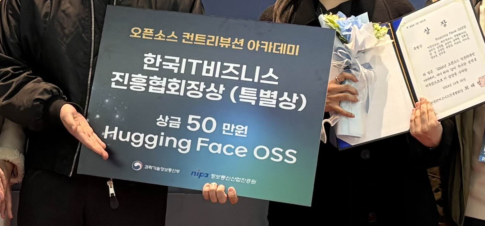
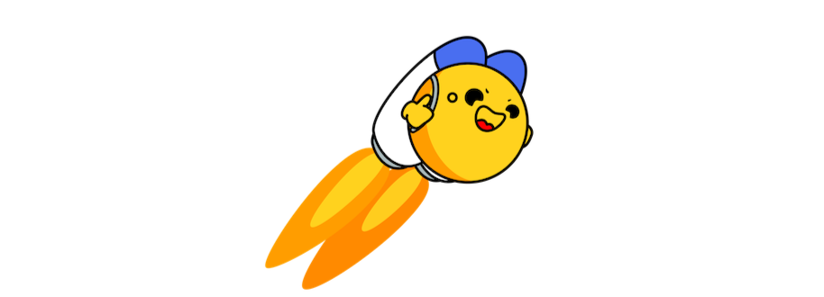

안녕하세요! 

Hugging Face KREW의 민주입니다. 

작년 2024년에는 Hugging Face OSS 프로젝트에 참여하며 Open Source Contribution Academy (OSSCA)에서의 여정을 마무리하었습니다. 

약 13주간의 시간 동안(2024. 7. 13 - 2024. 11. 2) 정말 많은 것을 배우고 기여할 수 있었습니다. 이 글에서는 제가 OSSCA 프로젝트에 참여하게 된 계기와 초반에 어떤 분야에 관심을 두고 활동했는지 이야기하며 그 경험을 회고해 보려고 합니다.

## 🤔 참여 계기 

저는 오픈소스를 통해 AI에 대한 최신 기술을 습득하고 배운 것을 공유하는 문화에 함께하고 싶어 이 프로젝트에 지원하게 되었습니다. 

특히, Hugging Face OSS 프로젝트에 관심을 갖게 된 계기는 가짜연구소 컨퍼런스(7th PseudoCon) 행사에 참여했을 때였습니다. 당시 하림님의 Hugging Face 관련 핸즈온 세션에서 RAG 세션을 청강했는데, 그때 세션에서 활용된 AI Cookbook 형태의 학습 자료가 흥미롭게 느껴져 저 또한 Hugging Face 생태계에 기여하고 싶은 동기를 갖게 되었습니다.

## **🌱 Challenges 기간 (4주): 첫걸음 내딛기**

처음 4주간의 Challenges 기간에는 Hugging Face 커뮤니티의 기여 가이드라인을 익히고, 공식 문서 한국어 번역 작업을 통해 기여 프로세스에 익숙해지는 데 집중했습니다.

- **프로세스 익히기:** Hugging Face GitHub 저장소를 Fork하고, 문서를 번역한 뒤, 팀 리뷰를 거쳐 Pull Request(PR)를 올리는 전반적인 과정을 체계적으로 배웠습니다.
- **협업 및 학습:** Discord 채널을 활용한 온라인 모각코(모여서 각자 코딩) 활동, 주차별 언어 모델 관련 퀴즈 풀이, 그리고 AI Cookbook 실습을 통해 Hugging Face 라이브러리를 익혔습니다.
- **팀 리뷰:** 번역 문서에 대한 팀 리뷰를 멘토님들과 멘티들이 함께 진행하며, 수정 및 제안을 주고받았습니다.

처음에는 오픈소스 기여 방법이 낯설었지만, 체계적인 프로세스와 팀원들의 도움 덕분에 자연스럽게 오픈소스 생태계에 입문할 수 있었습니다. 또한 Challenges 기간의 번역 기여 활동을 하며 문서 최신화 필요성이나 용어 일관성 확보 등 개선하고 싶은 부분이 생겨, Masters 기간에 해당 기여 아이디어를 제안하고 실제 활동으로 이어가기도 하였습니다.

## **🚀 Masters 기간 (9주): 기여 분야 확장하기**

Masters 기간에는 멘티들이 각자의 관심사에 따라 다양한 기여 분야에 참여할 수 있도록 소그룹 활동이 진행되었습니다. 주요 활동은 Hub 번역, Cookbook 제작, 컴퓨터 비전 코스 제작, Code 기여, 커뮤니티 기여, 스터디로 나뉘었습니다.

저는 이 기간 동안 다음과 같은 활동에 참여하며 기여 범위를 넓혔습니다. 

### **✨ 주요 기여 활동 소개**

1. **Hugging Face Docs 한국어 번역:**
    - Challenges 기간부터 이어온 핵심 활동입니다. Google Docs로 번역 문서를 공유하고, NMT (신경망 번역 모델, 예: ChatGPT)를 활용하여 초안을 생성한 뒤, 직접 수정하고 팀 리뷰를 거쳐 PR을 올리는 과정을 반복했습니다.

    - 이 과정에서 GitHub Codespaces와 Hugging Face Docs i18n 번역 도구 등 Hugging Face KREW 분들이 제작한 유용한 툴을 사용했습니다.

    - PR을 merge하는 과정은 Hugging Face 직원분께 최종 리뷰를 받고 소통하며 진행되었습니다.

2. **Code 기여 (Diffusers 라이브러리 Docstring 개선)**:
    - 영향력 있는 Hugging Face 공식 저장소인 `diffusers`에 코드 기여를 시도했습니다. 특히 초보자가 시작하기 좋은 `Good First Issue` 라벨이 붙은 이슈를 해결하며, Docstring을 개선하는 활동을 했습니다. 이는 코드 가독성과 유지보수성 향상에 기여할 수 있었습니다.

3. **Community 기여 (Hugging Face KREW 활동)**:
    - 프로젝트 팀원뿐만 아니라 외부 커뮤니티 멤버들과 함께하는 활동에 참여했습니다.

    - **Hugging Face KREW Blog 제작:** Jekyll을 활용하여 초보 컨트리뷰터를 위한 가이드 및 커뮤니티 소통 창구 역할을 하는 블로그를 직접 만들고 운영했습니다. Hugging Face 생태계 활용 사례 등 양질의 글도 업로드했습니다. 
    또한 공식 문서가 빠르게 업데이트되면서 번역된 문서가 최신 버전을 반영하지 못하는 문제를 해결하기 위해, outdated된 문서나 아직 번역되지 않은 문서를 추적하는 리포트를 만들었습니다.
    
    - **초벌 번역기 업데이트:** 기존 번역 작업 효율을 높이는 도구인 '초벌 번역기'를 개선하여, 팀 내에서 통일된 용어 사용을 위해 관리하던 Glossary(용어 사전)를 번역 과정에 자동으로 반영하도록 기능을 추가했습니다. 이를 통해 번역의 일관성을 높이고 리뷰어들의 부담을 줄였습니다.

제가 참여했던 주요 활동 외에도, **Hugging Face OSS 팀원들은 Masters 기간 동안 세부 프로젝트별 소그룹 활동을 통해 다양한 분야에서 기여 범위를 확장했습니다**. 이 과정을 통해 **총 7분의 멘티분들이 Hugging Face Significant Community Contributor로 선정되는 의미있는 성과**도 있었습니다.

팀원들이 함께 만들어간 주요 기여 활동은 다음과 같습니다.

### **✨ 팀원들의 다양한 기여 활동**

1. **기능 개선**:
    - [Transformers](https://github.com/huggingface/transformers) 및 [Diffusers](https://github.com/huggingface/diffusers) 라이브러리의 **기능을 추가하거나 버그를 개선하는 활동**에 참여했습니다. **Hugging Face 레포지토리에서 지속적으로 언급된 주요 이슈들을 해결하는데 기여**했으며, 구체적으로는 **인증 기능 개발 및 테스트 오류 해결**, **CPU 자원 효율성을 높이는 GGUF 방식 적용 개발**, 그리고 **Docstring 개선**을 통해 코드 가독성 및 유지보수성을 향상시키는 활동을 진행했습니다.

2. **AI 학습 콘텐츠 개발**:
    - Hugging Face 생태계 활용에 도움이 되는 **AI Cookbook 및 Vision Course의 학습 콘텐츠를 번역하고 제작하는 활동**을 했습니다. 특히, **AI Cookbook 4건을 한글화하고 Vision Course 4건을 제작하는 구체적인 성과**를 달성했습니다.

3. **커뮤니티 확장**:
    - **처음 오픈소스 기여를 시작하는 분들도 Hugging Face 생태계에 쉽게 참여할 수 있도록 돕는 커뮤니티 기여 활동**을 진행했습니다. **Hugging Face OSS 팀 자체 페이지(Hugging Face KREW Blog)를 제작하고 운영**하며, 초보 컨트리뷰터를 위한 가이드 제공 등 **커뮤니티 소통 및 참여 확대를 위한 노력**을 기울였습니다.

4. **LLM 활용 스터디**:
    - 주 1회 오프라인 스터디를 통해 LLM을 활용한 애플리케이션 개발 서적을 공부했습니다. 발표와 패널 토의 방식을 통해 Hugging Face 기여와 관련된 기술적 이해도를 높일 수 있었습니다.

## **📊 정량적 성과 및 특별상 수상**

약 13주간의 활동을 통해 공식 저장소(Transformers/Diffusers)와 커뮤니티 저장소를 포함하여 저는 총 **7건의 Pull Request 등록**, **3건의 PR Merge**, 그리고 **25건의 Commit**을 달성했습니다. 특히 초벌 번역기 개선을 통한 공식 문서 번역 생산성이 향상되었다는 피드백도 있었습니다. 

Masters 기간을 마치고 성과 공유회 준비를 위해 팀원분들과 함께 약 13주간의 활동 내용을 되돌아보고, 공식 저장소와 커뮤니티 저장소에 기여한 Pull Request, Commit 등의 성과를 모아 정리했습니다. 이 과정에서 체계적인 협업 프로세스와 팀원들의 도움을 통해 함께 이뤄낸 구체적인 기여 결과를 객관적으로 확인하며 값진 경험을 되새길 수 있었습니다.

### **🧑‍🎓 배우고 느낀 점**

OSSCA Hugging Face 프로젝트를 통해 다양한 기여 활동을 경험하며 오픈소스 커뮤니티에 기여하는 즐거움을 알게 되었습니다. OSSCA 스태프 분들 및 멘토님들의 지원 덕분에 원하는 활동에 자유롭게 참여하며 의미있는 시간을 보낼 수 있었습니다. 특히 커뮤니티에 기여할 아이디어를 발전시키고, 오픈소스 기여에도 자신감을 가지고 참여하며 성장한 것을 실감했습니다.

### 더 많은 후기

OSSCA 홈페이지에서 [후기 모음](https://www.contribution.ac/1c236dcb-0b5f-8132-a06a-e1ace0e07c0c
)을 통해 컨트리뷰터분들의 다양한 후기를 확인하실 수 있습니다.

## **🤗 OSSCA 그 이후**

OSSCA 이후에도 KREW 분들의 열정적인 활동은 가짜연구소 내 스터디에서 문서 번역, 기능 개선 및 코드 기여, 학습 콘텐츠 개발, 커뮤니티 활동 등 다양한 형태로 이어지고 있습니다. [Activities](https://hugging-face-krew.github.io/activities/) 페이지에서 더 자세한 내용을 확인할 수 있습니다. 

이처럼 KREW 분들이 지속적으로 활동해주신 덕분에, 저 또한 Hugging Face KREW Blog 제작팀에 합류하여 커뮤니티에 기여를 이어나가고 있습니다.

저희 Hugging Face KREW는 **"누구나 머신러닝을 활용할 수 있도록 하여, 사회에 긍정적인 변화를 이끌자!"라는 비전** 아래 함께 활동하고 있습니다. 앞으로 Hugging Face KREW 블로그에는 **OSSCA 이후에도 꾸준히 활동하고 있는 KREW 멤버들의 다채로운 기여 활동과 그 경험 스토리가 담길 예정입니다.**

**여기까지 OSSCA Hugging Face OSS 프로젝트에 참여하며 겪었던 저의 여정을 들려드렸습니다.** 저희 팀의 활동과 성과, 그리고 앞으로의 계획까지 **긴 글 읽어주셔서 감사합니다!** Hugging Face KREW의 다양한 활동에도 많은 관심과 응원 부탁드립니다. 
