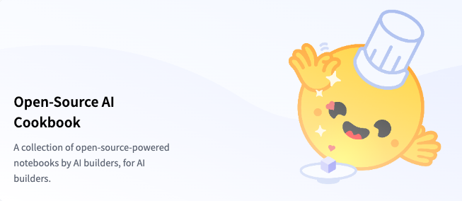
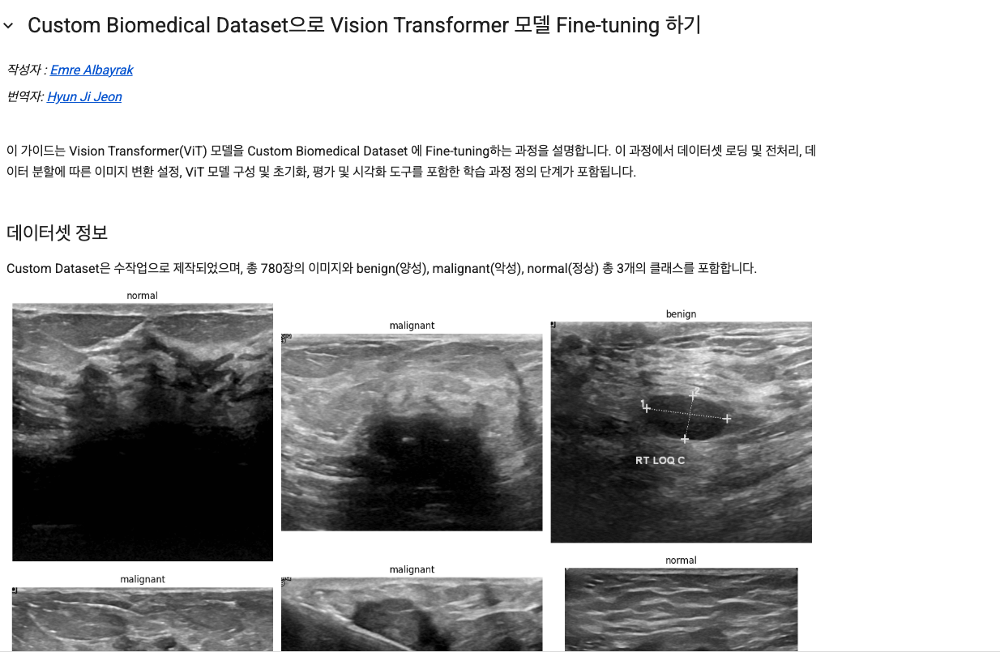
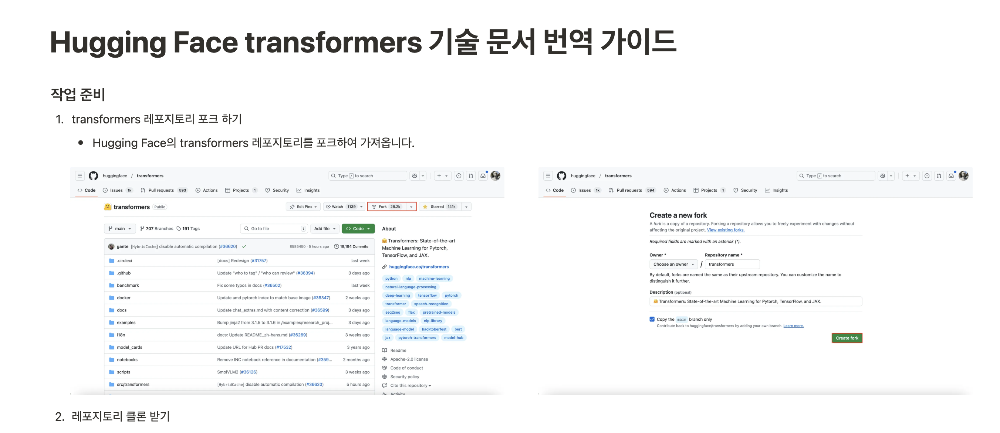
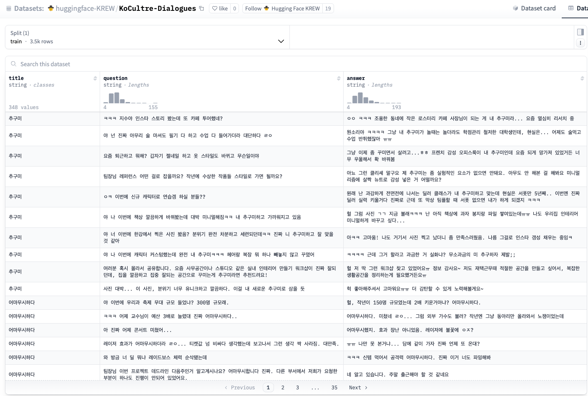
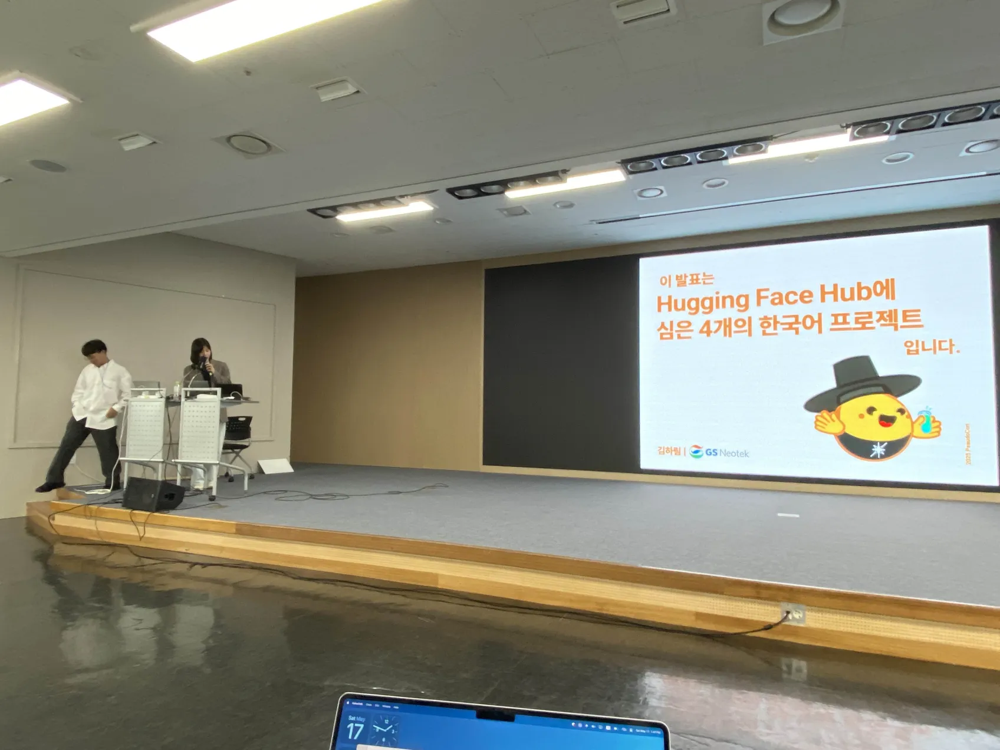
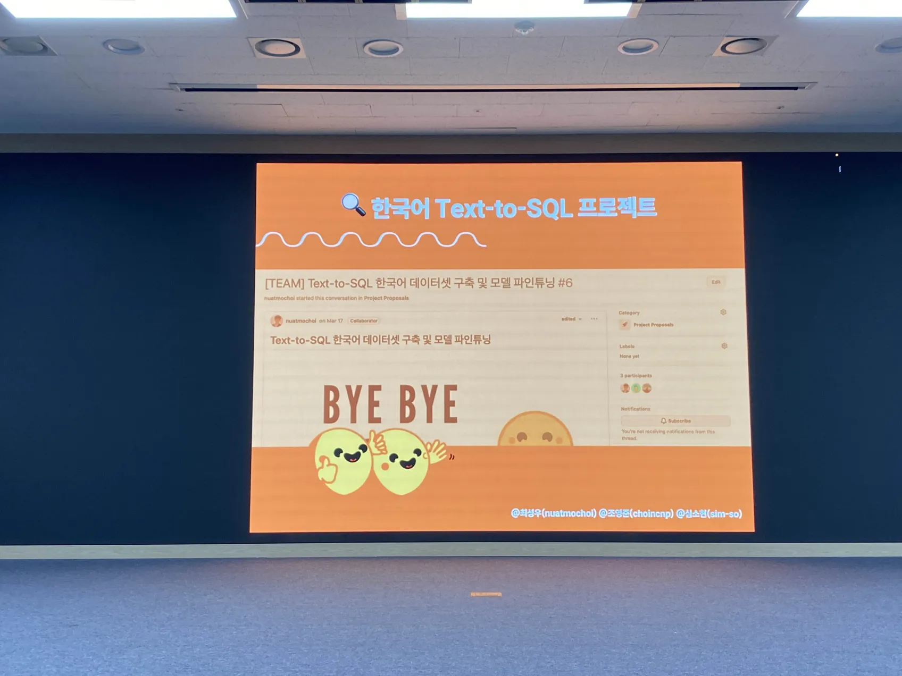
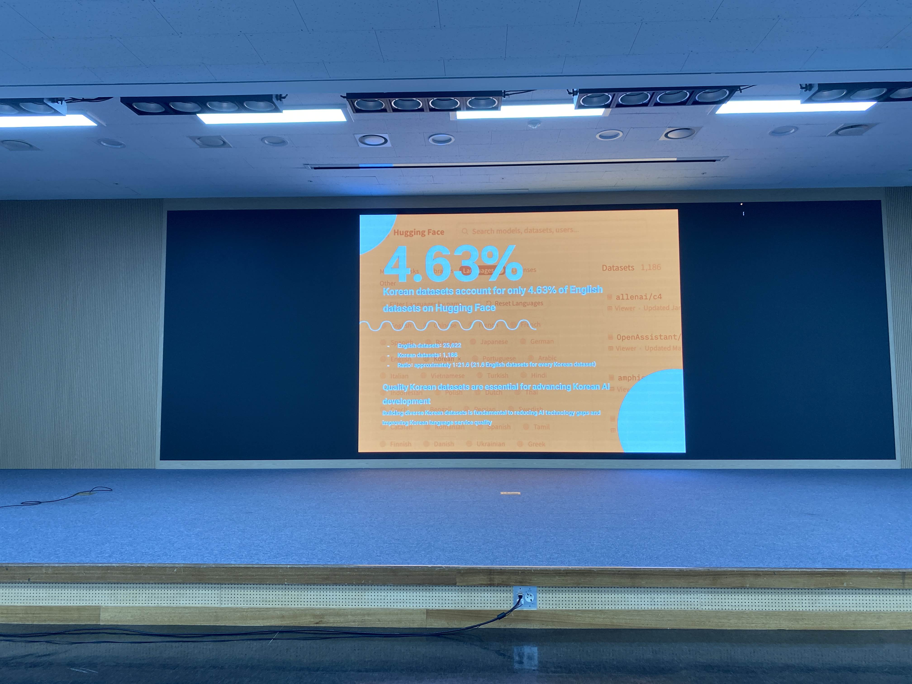

* TOC
{:toc}
<!--toc-->
5월 17일, 비영리 연구 공동체 '가짜 연구소'가 주최한 2025 PseudoCon에 참여한 현장을 생생히 전달드립니다 🤗
----
Hugging Face KREW 리서치 팀은 인공지능 및 데이터 과학 비영리 모임인 가짜 연구소의 일원으로 활동하고 있는데요, 
이번 컨퍼런스에서는 KREW의 다양한 활동과 현재 진행 중인 세 가지 프로젝트의 여정을 공유하는 시간을 가졌습니다 🤗

# 👩🏻‍🍳 Hugging Face 쿡북요리사

    
    

Hugging Face에는 오픈소스 도구와 모델을 활용해 AI 애플리케이션을 구축하고 다양한 과제를 해결할 수 있는 실용적인 예제들을 모아둔 **AI Cookbook**이 있습니다.

쿡북요리사 활동에서는 이 AI Cookbook 자료를 활용해 다양한 AI 분야에 대해 실습, 발표, 한글화 작업을 진행하고 있는데요.

    

`NLP`부터 `Vision`, `Agent` 까지 다양한 분야와 도메인에 대해 다룬 Cookbook을 한국어화 한 자료를 공유하고,

    

특별히 [IP-Adapter 쿡북](https://huggingface.co/docs/diffusers/using-diffusers/ip_adapter)을 파인튜닝하여 제작한 `싸이월드 미니미 생성` 실습을 제공해 길가던 수많은 참가자들의 발길을 돌렸답니다 😎

    

# 🚀 Hugging Face Beyond First PR

오픈소스 기여의 꽃, 코드기여에 관심을 보이신 많은 참가자 분들로 북적였던 Beyond First PR 부스.

Beyond First PR 프로젝트에서는 Hugging Face에 존재하는 다양한 오픈소스 라이브러리 코드를 개선함으로써, 직접적으로 AI 오픈소스 커뮤니티에 기여하고 있습니다.

    
    

Beyond First PR 부스에서는 현재 진행중인 코드기여 이슈들과 진행 과정, 코드기여 과정 중 어려웠던 점들을 꾹꾹 눌러담은 [가이드북](https://github.com/user-attachments/files/20533125/HuggingFaceKREW-BeyondFirstPR.2.pdf)
을 제작해,

 PseudoCon을 찾아주신 참가자분들께 오픈소스 기여를 독려해주셨는데요!

    

이 가이드북 외에도 `첫 코드기여 이슈 찾는 법`과 `[기술 문서 번역](https://yijunlee.notion.site/hugging-face-transformers-translation-guide)` 가이드도 함께 제공하여, 오픈소스에 기여하고 싶지만 도전하기 어려우셨던 분들, 어떻게 기여점을 찾으면 좋을까 고민하시던 분들께 마중물 같은 시간이 되었으리라 생각합니다!

    

# 🌿 Hugging Face Hub Garden

[Hugging Face Hub](https://huggingface.co/docs/hub/index)는 AI 모델, 데이터셋, 앱을 자유롭게 공유하고 협업하는 플랫폼으로,

Hub Garden 팀에서는 이 Hub를 활용해 **자신만의 데이터셋을 구축하고 모델을 직접 훈련하여 공유**하는 4가지 프로젝트를 진행중입니다.

이번 PseudoCon를 통해 Hub Garden는 부스에서 4가지 데이터셋 프로젝트 과정을 공개하며, 각 프로젝트 담당자들로부터 데이터 수집 과정, 전처리 방법, 그리고 앞으로의 해결 과제 등 실질적인 조언을 데이터셋의 유형과 성격에 따라 직접 들을 수 있었습니다.

    

직접 구축한 데이터셋으로 훈련한 모델로 [*가상 여자친구 Exagirl와의 롤플레잉*](https://huggingface.co/spaces/huggingface-KREW/EXAGIRL-7.8B) 체험도 제공했는데요, 수많은 참가자들이 엑사걸을 찾아주셨다고 합니다. 😂

4가지 Hub Garden 프로젝트에서 구축한 데이터셋과 모델은 [이곳](https://huggingface.co/huggingface-KREW)에서 확인 가능합니다! 

또한 이번 PseudoCon에서는 Hub Garden의 빌더 김하림님께서 각 Hub Garden 프로젝트를 소개해주시는 시간을 가졌습니다. 

    
    

Hugging Face 에 등재된 영어 데이터셋 중 `4.63%` 만이 한국어 데이터셋이라는 점을 강조해주시며,

한국어 데이터셋 구축 프로젝트의 의의와 긴급성에 대해 상기시킬 수 있었습니다!

    

발표 중에는 Hub Garden 프로젝트 뿐만 아니라 Hugging Face KREW에서 진행중인 활동에 대해 공유해주셨습니다!

    

이를 계기로 국내 많은 AI/데이터과학 개발자들에게 Hugging Face KREW의 존재를 알리고, Hugging Face 오픈소스 기여와 KREW 생태계에 기여하는 성과를 가졌습니다! 🌱

## 마무리
부스 진행 중 오픈소스 Hugging Face에 기여하는 것의 의미에 대한 질문을 받기도 했는데요.
저는 이렇게 표현하고 싶습니다.

<aside>
대한민국 누구나 머신러닝을 활용할 수 있도록 하여, 사회에 긍정적인 변화를 이끄는 것
</aside>

저희의 여정은 [Hugging Face KREW Space](https://huggingface.co/huggingface-KREW)와, 저희 KREW Blog를 통해 계속 확인하실 수 있습니다!

    

